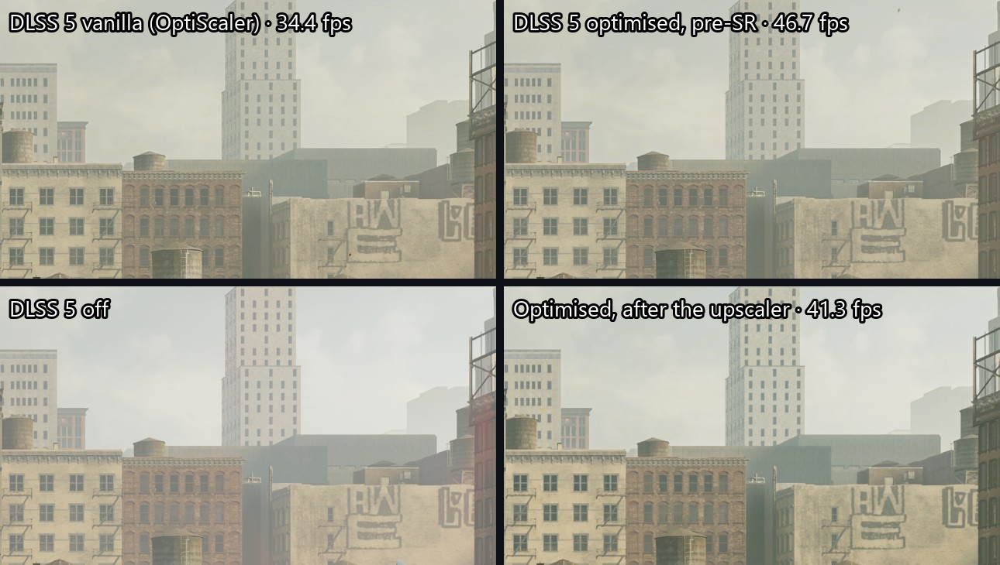

# OptiScaler DLSS 5

Fork d'[OptiScaler](https://github.com/optiscaler/OptiScaler), basé sur
[OptiScaler_DLSSNR](https://github.com/Dagherbou/OptiScaler_DLSSNR) de Dagherbou, qui fait tourner
DLSS 5 Neural Rendering pour beaucoup moins cher et avec moins de scintillement.

Le modèle NVIDIA (`nvngx_dlssnr.dll`) n'est pas fourni.

## Résultats

Control Resonant, RTX 4070, 2560x1440, DLSS Équilibré (rendu interne 1484x835). Les FPS sont les
images calculées par le jeu, génération d'images exclue. Même scène, caméra fixe, 8 s de mesure par
mode après 3 s de stabilisation.

| Mode | FPS | 1 % low | Coût DLSS 5 | Scintillement | Détail ajouté |
|---|---:|---:|---:|---:|---:|
| DLSS 5 désactivé | 62,2 | 28,3 | - | 0,30 % | - |
| DLSS 5 d'origine (OptiScaler) | 34,4 | 15,1 | 13,0 ms | 0,57 % | +12 % |
| **Quality** : pre-SR, modèle à chaque image | **46,7** (+36 %) | 23,3 | 5,5 ms | 0,40 % | +13 % |
| Balanced : après SR, modèle à 67 %, 1 image sur 2 | 48,1 (+40 %) | 18,5 | 4,7 ms | 0,42 % | +15 % |
| **Performance** : pre-SR, 1 image sur 2 | **55,3** (+61 %) | 24,3 | 2,9 ms | 0,47 % | +10 % |

- **Scintillement** : variation moyenne de luminosité d'une image à la suivante, caméra immobile,
  sans les 5 % de pixels les plus animés (le mode désactivé donne le bruit propre au jeu).
- **Détail ajouté** : micro-contraste de l'image par rapport à DLSS 5 désactivé, sur la partie fixe
  de la scène.

### Face aux autres DLSS 5

Même scène, chaque outil sur ses réglages les plus rapides (coût journalisé par chaque outil, FPS
estimés de la même façon pour tous) :

| | Coût DLSS 5 | FPS estimés | Scintillement | Détail |
|---|---:|---:|---:|---:|
| **Ce fork, Performance** | **2,89 ms** | **52,7** | 0,40 % | x1,19 |
| F5 v0.1.27, DetailReuse | 3,50 ms | 51,1 | 0,52 % | x1,23 |
| ShyVortex v0.9.34, pre-SR 75 % | 3,74 ms | 50,5 | 0,37 % | x1,11 |
| F5 v0.1.27, pre-SR | 4,85 ms | 47,8 | 0,41 % | x1,25 |
| ShyVortex v0.9.34, pre-SR 100 % | 5,35 ms | 46,7 | 0,45 % | x1,34 |
| **Ce fork, Quality** | 5,53 ms | 46,3 | **0,36 %** | x1,32 |

L'addon RenoDX DLSS5 ne s'enclenche pas dans Control Resonant (ou fige le jeu avec les hooks
Streamline), il n'a pas pu être mesuré.

Détail des mesures et méthode : [docs/comparaison.md](docs/comparaison.md).



### Pourquoi le compteur du jeu ne montre pas toujours le gain

Avec la génération d'images (MFG x2 à x6), le compteur affiché multiplie les images calculées puis
plafonne à la fréquence de l'écran. En x6 sur un écran 240 Hz, 31 FPS de base donnent 186 et 48 en
donneraient 288, mais l'écran coupe vers 225 : les deux semblent proches alors que l'un calcule 55 %
d'images réelles en plus. La touche F6 affiche le vrai chiffre.

## Ce qui change

- **Cache de correction** : le modèle ne tourne qu'une image sur N. Ce qu'il change (un rapport par
  pixel, jamais l'image) est reprojeté avec les vecteurs de mouvement, validé pixel par pixel
  (profondeur, couleur) et réappliqué sur l'image fraîche du jeu.
- **Pre-SR** : le modèle tourne sur l'image en résolution de rendu, juste avant DLSS Super
  Resolution, qui agrandit ensuite le résultat. Environ trois fois moins de pixels à traiter, et
  l'accumulation temporelle de DLSS lisse ce que le modèle ajoute.
- **Point blanc automatique** : mesuré sur chaque scène avant le passage du modèle, plus de
  « paper white » à régler à la main.
- **Anti-scintillement** : stabilisateur temporel de la correction, mises à jour lissées entre deux
  passages du modèle, despeckle, stabilisation de luminance par zones (écrans OLED).
- **Modèle à résolution réduite** avec agrandissement guidé par les contours (placement après SR).
- **Comparaison en direct** : F6 bascule optimisé / d'origine / désactivé sans toucher aux réglages,
  avec les FPS réels à l'écran.
- **Benchmark intégré** : les modes à la suite, une capture de chacun, et un rapport HTML.

Tout s'active et se désactive dans le menu OptiScaler et dans `OptiScaler.ini`. Désactivé, le
comportement est celui d'origine.

## Installation

Avec le paquet de la page Releases : lancer `INSTALLER.bat` et glisser le dossier du jeu (celui de
l'exécutable). L'installeur choisit un nom de fichier libre (`winmm.dll`, ou `OptiScaler.asi` si un
ASI Loader est présent) et n'écrase rien. `DESINSTALLER.bat` remet tout comme avant.

Il faut une carte RTX, un pilote récent, Python, et `nvngx_dlssnr.dll` (l'installeur le cherche dans
le dossier du jeu ou dans `%LOCALAPPDATA%\RHI\DLSS-NR`).

En jeu : activer DLSS, menu OptiScaler avec la touche Inser, section « DLSS Neural Rendering ».

## Compiler

Visual Studio 2026 Build Tools (toolset v145) :

```
msbuild OptiScaler\OptiScaler.vcxproj /p:Configuration=Release /p:Platform=x64 /p:PlatformToolset=v145
```

Le shader du cache se recompile avec `fxc`, celui de la composition avec `dxc` : voir
[OptiScaler/dlssnr/README.md](OptiScaler/dlssnr/README.md) et
[OptiScaler/dlssnr/design/edit-cache.md](OptiScaler/dlssnr/design/edit-cache.md).
`deploy/install.py` installe le build dans un jeu.

## Licence et crédits

GPL-3.0, comme OptiScaler. Le README d'origine est dans [README_OptiScaler.md](README_OptiScaler.md).

- OptiScaler : cdozdil et l'équipe OptiScaler.
- Intégration de DLSS 5 Neural Rendering : Dagherbou.
- Composition couleur reprise de l'addon DLSS 5 de RenoDX (clshortfuse, licence MIT) : voir
  [Licenses/RenoDX_ATTRIBUTION.txt](Licenses/RenoDX_ATTRIBUTION.txt).

Projet non officiel, sans lien avec NVIDIA. Il utilise une fonction non documentée du pilote ;
`nvngx_dlssnr.dll` appartient à NVIDIA et n'est pas redistribué ici.
