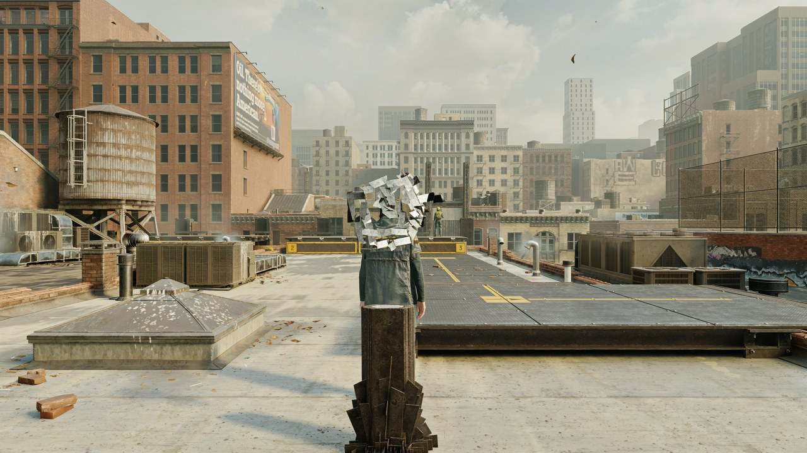
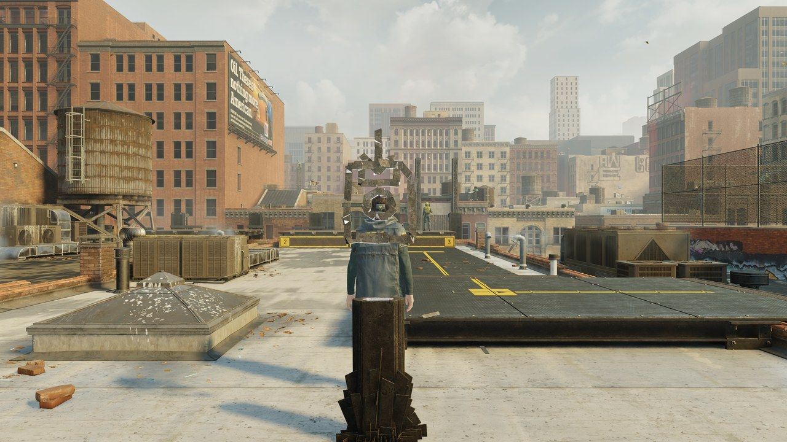
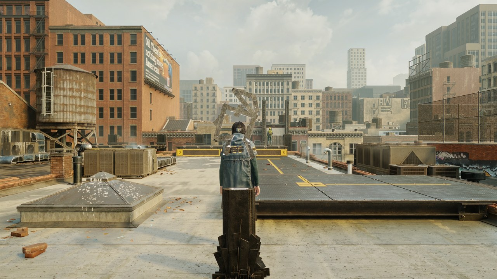

# Comparaison

## Conditions

- Control Resonant (DX12), RTX 4070, 2560x1440, DLSS Équilibré : rendu interne 1484x835.
- Benchmark intégré (menu > Benchmark, ou fichier `dlssnr-benchmark.trigger` à côté d'OptiScaler) :
  les modes à la suite sur la même scène, 3 s de stabilisation puis 8 s de mesure chacun.
- FPS : intervalle entre deux appels de l'upscaler, c'est-à-dire les images que le jeu calcule. La
  génération d'images est exclue exprès : elle multiplie le chiffre affiché sans rien coûter ici.
- Coût DLSS 5 : la passe complète sur le GPU (copies, modèle, composition, cache), moyennée.
- Après chaque mode, 10 images consécutives de la sortie de l'upscaler sont relues :
  - scintillement : variation moyenne de luminosité d'une image à la suivante, sans les 5 % de
    pixels qui bougent le plus (objets animés, particules) ;
  - la première est enregistrée en PNG, développée avec la même exposition pour tous les modes.
- Détail ajouté : énergie du laplacien de la luminance (log) sur la partie fixe de la scène,
  rapportée au mode désactivé. Calculé hors jeu sur les PNG.

## Série 1 : réglage par défaut (Quality)

| Mode | FPS | 1 % low | Temps d'image | Coût DLSS 5 | Scintillement | Détail |
|---|---:|---:|---:|---:|---:|---:|
| DLSS 5 désactivé | 62,2 | 28,3 | 16,08 ms | - | 0,30 % | x1,00 |
| DLSS 5 d'origine | 34,4 | 15,1 | 29,04 ms | 13,03 ms | 0,57 % | x1,12 |
| Quality (pre-SR, chaque image) | 46,7 | 23,3 | 21,40 ms | 5,53 ms | 0,40 % | x1,13 |
| Même chose après SR (67 % + agrandissement guidé) | 41,3 | 16,2 | 24,22 ms | 8,16 ms | 0,44 % | x1,14 |

## Série 2 : modèle une image sur deux

| Mode | FPS | 1 % low | Temps d'image | Coût DLSS 5 | Scintillement | Détail |
|---|---:|---:|---:|---:|---:|---:|
| DLSS 5 désactivé | 62,1 | 24,4 | 16,09 ms | - | 0,30 % | x1,00 |
| DLSS 5 d'origine | 34,4 | 15,5 | 29,05 ms | 13,05 ms | 0,43 % | x1,12 |
| Performance (pre-SR, 1 image sur 2) | 55,3 | 24,3 | 18,10 ms | 2,89 ms | 0,47 % | x1,10 |
| Balanced (après SR, 67 %, 1 image sur 2) | 48,1 | 18,5 | 20,79 ms | 4,68 ms | 0,42 % | x1,15 |

Le scintillement du mode d'origine varie d'une série à l'autre (0,43 à 0,57 %) : la scène contient
des débris animés. Les écarts de moins de 0,05 point ne sont pas significatifs.

## Ce que les essais ont appris

- Le pre-SR seul (sans cache) garde tout le détail du modèle : x1,12 à x1,28 selon la vue, autant ou
  plus que le mode d'origine, pour 47 à 53 FPS.
- Avec le cache, le pre-SR perdait du détail (x1,05) : les mises à jour lissées et le stabilisateur
  temporel mélangeaient des réponses du modèle calculées pour des positions de jitter différentes.
  En pre-SR, ces deux filtres s'effacent maintenant (l'accumulation de DLSS SR fait ce travail) :
  x1,09 à x1,15.
- La compensation du jitter dans le cache réduit le scintillement du pre-SR de 0,54 à 0,47 %.

## Captures

| | |
|---|---|
|  DLSS 5 d'origine |  Quality (pre-SR) |
|  DLSS 5 désactivé |  Après SR |
