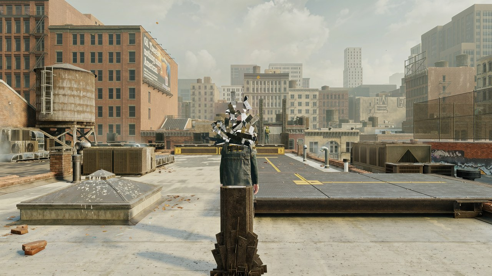

# Comparison

## Setup

- Control Resonant (DX12), RTX 4070, 2560x1440, DLSS Balanced: 1484x835 internal.
- Built-in benchmark (DLSS 5 tab > Benchmark, or a `dlssnr-benchmark.trigger` file next to
  OptiScaler): the modes run back to back on the same scene, 3 s warm-up then 8 s measured each.
- FPS: the interval between two upscaler calls, i.e. the frames the game renders. Frame generation is
  left out on purpose: it multiplies the displayed number without costing anything here.
- DLSS 5 cost: the whole pass on the GPU (copies, model, composition, cache), averaged.
- After each mode, 10 consecutive frames of the upscaler's output are read back:
  - flicker: average frame-to-frame brightness change, ignoring the 5% of pixels that move the most
    (animated objects, particles);
  - the first frame is saved as a PNG, developed with the same exposure for every mode.
- Added detail: energy of the luminance (log) Laplacian on the static part of the scene, relative to
  DLSS 5 off. Computed offline from the PNGs.

## Run 1: default settings (Quality)

| Mode | FPS | 1% low | Frame time | DLSS 5 cost | Flicker | Detail |
|---|---:|---:|---:|---:|---:|---:|
| DLSS 5 off | 62.2 | 28.3 | 16.08 ms | - | 0.30% | x1.00 |
| DLSS 5 as OptiScaler ships it | 34.4 | 15.1 | 29.04 ms | 13.03 ms | 0.57% | x1.12 |
| Quality (pre-SR, every frame) | 46.7 | 23.3 | 21.40 ms | 5.53 ms | 0.40% | x1.13 |
| Same, after SR (67% + edge-aware upscale) | 41.3 | 16.2 | 24.22 ms | 8.16 ms | 0.44% | x1.14 |

## Run 2: model every other frame

| Mode | FPS | 1% low | Frame time | DLSS 5 cost | Flicker | Detail |
|---|---:|---:|---:|---:|---:|---:|
| DLSS 5 off | 62.1 | 24.4 | 16.09 ms | - | 0.30% | x1.00 |
| DLSS 5 as OptiScaler ships it | 34.4 | 15.5 | 29.05 ms | 13.05 ms | 0.43% | x1.12 |
| Performance (pre-SR, every other frame) | 55.3 | 24.3 | 18.10 ms | 2.89 ms | 0.47% | x1.10 |
| Balanced (after SR, 67%, every other frame) | 48.1 | 18.5 | 20.79 ms | 4.68 ms | 0.42% | x1.15 |

The vanilla flicker moves between runs (0.43 to 0.57%) because the scene has animated debris in it.
Differences under 0.05 points are not meaningful.

## What the tests taught us

- Pre-SR on its own (no cache) keeps all of the model's detail: x1.12 to x1.28 depending on the view,
  as much as vanilla or more, at 47 to 53 FPS.
- With the cache, pre-SR used to lose detail (x1.05): the smoothed updates and the temporal
  stabiliser were blending model answers computed for different jitter positions. In pre-SR those
  two filters now step aside (DLSS SR's accumulation does that job): x1.09 to x1.15.
- Jitter compensation in the cache brings pre-SR flicker down from 0.54% to 0.47%.

## Against the other DLSS 5 builds (6 October 2026)

Same conditions, same scene, each tool on its fastest settings:

- **ShyVortex/OptiScaler-DLSSNR-PreSR-Multipass v0.9.34**: pre-SR, model at 100% then 75%, automatic
  white point (`WhitePointSource=3`). With its default setting (manual white point) the model does
  almost nothing in Control (detail x0.99, effect 0.03 stop).
- **janblade/OptiScaler-F5-DLSSNR-Multipass v0.1.27**: pre-SR with the model's bottleneck reused every
  other frame (`VitEvery=2`), then after SR with `DetailReuse` and automatic model resolution.
- **RenoDX DLSS5 add-on** (19 September build): does not work in Control Resonant. Without the
  Streamline hooks it never engages (0 evaluations); with `EnableHooks=1` the game freezes at startup.
  Newer builds are only on the RenoDX Discord and were not tested.

Cost is what each tool logs for its own full pass. Those forks replace OptiScaler, so our benchmark
cannot measure them directly: FPS is estimated as 1000 / (16.08 ms + cost), 16.08 ms being the frame
time measured with DLSS 5 off. The formula lands within 1% of our real measurements (vanilla 34.4
measured, 34.4 estimated; Quality 46.7 and 46.3).

Flicker, detail and effect are measured the same way for all of them, from 12 consecutive screen
captures (static part of the scene, character excluded). That is an HDR game captured in SDR, so the
absolute values differ from the tables above; only the differences matter.

| Mode | DLSS 5 cost | Est. FPS | Flicker | Detail | Effect |
|---|---:|---:|---:|---:|---:|
| DLSS 5 off | - | 62.2 | 0.34% | x1.00 | - |
| DLSS 5 as OptiScaler ships it | 13.03 ms | 34.4 | 0.38% | x1.14 | 0.12 stop |
| **This fork: Performance** (pre-SR, every other frame) | **2.89 ms** | **52.7** | 0.40% | x1.19 | 0.15 stop |
| F5: after SR + DetailReuse | 3.50 ms | 51.1 | 0.52% | x1.23 | 0.15 stop |
| ShyVortex: pre-SR 75% | 3.74 ms | 50.5 | 0.37% | x1.11 | 0.17 stop |
| F5: pre-SR, VitEvery 2 | 4.85 ms | 47.8 | 0.41% | x1.25 | 0.13 stop |
| ShyVortex: pre-SR 100% | 5.35 ms | 46.7 | 0.45% | x1.34 | 0.18 stop |
| **This fork: Quality** (pre-SR, every frame) | 5.53 ms | 46.3 | 0.36% | x1.32 | 0.15 stop |

Takeaways:

- Our Performance mode is the cheapest of the lot (2.89 ms, 17% below the next one), with more detail
  than ShyVortex at 75% and less flicker than F5's DetailReuse.
- Our Quality mode is among the steadiest (0.36%, level with ShyVortex at 75%, which has clearly less
  detail), with as much detail as ShyVortex at 100%, which flickers more.
- It does cost 0.7 ms more than F5's pre-SR, which reuses part of the model's internal work from one
  frame to the next. That is the next thing to look at.
- Flicker differences under 0.05 points and effect differences under 0.02 stop are within measurement
  noise (one scene, one run per mode).

## Model styles and multi-pass (OptiScaler base of 6 October)

Two runs, each with its own references (off and vanilla), Quality preset:

| Mode | FPS | 1% low | DLSS 5 cost | Flicker | Detail | Effect | Mean shift |
|---|---:|---:|---:|---:|---:|---:|---:|
| DLSS 5 as OptiScaler ships it (run 1) | 35.1 | 28.1 | 13.11 ms | 0.43% | x1.11 | 0.29 stop | -0.11 stop |
| Style Default | 47.4 | 29.9 | 5.54 ms | 0.40% | x1.12 | 0.29 stop | -0.12 stop |
| Style Natural | 47.6 | 36.1 | 5.63 ms | 0.36% | x1.19 | 0.28 stop | -0.23 stop |
| Style Cinematic | 47.1 | 32.0 | 5.62 ms | 0.42% | x0.87 | 0.25 stop | -0.19 stop |
| DLSS 5 as OptiScaler ships it (run 2) | 35.0 | 29.3 | 13.11 ms | 0.52% | x1.12 | 0.29 stop | -0.12 stop |
| 1 pass | 47.7 | 27.3 | 5.55 ms | 0.38% | x1.13 | 0.29 stop | -0.13 stop |
| 2 passes | 37.6 | 28.8 | 10.82 ms | 0.47% | x1.25 | 0.44 stop | -0.21 stop |
| 2 passes, model every other frame (run 3) | 48.0 | 29.7 | 5.52 ms | 0.63% | x1.18 | 0.43 stop | - |

- The style does not change the cost. Natural adds more micro-detail than Default and darkens a bit
  more; Cinematic smooths things out. That is the main reason a RenoDX setup on Natural does not look
  like this fork's default.
- A second pass costs a full model run and makes the effect clearly stronger. With the cache (model
  every other frame), two passes cost the same as one pass every frame.

## Captures

| | |
|---|---|
|  DLSS 5 as OptiScaler ships it |  Quality (pre-SR) |
|  DLSS 5 off |  After SR |
